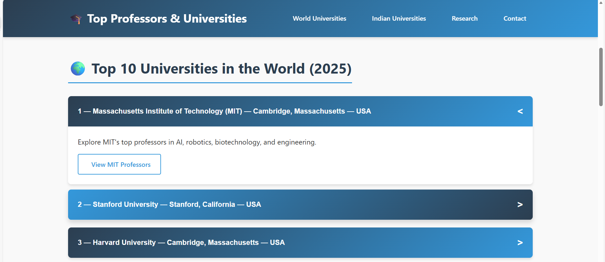
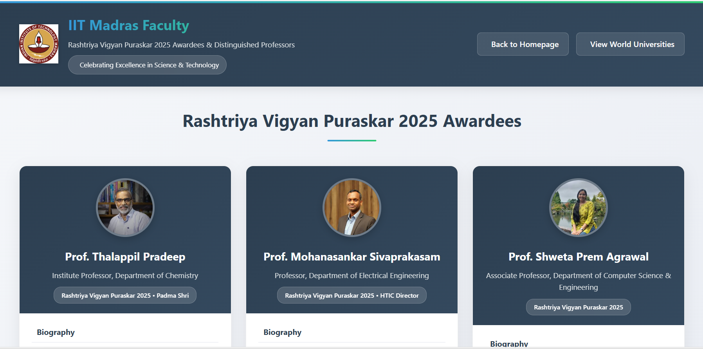

<h1>Top Professors & Universities – 2025</h1>

<h2>🚀 Live Demo </h2>

  

A responsive and interactive <strong>educational web project</strong> showcasing
the <strong>top universities and influential professors across the world and India (2025)</strong>.
This project highlights global academic excellence, research leadership, and
institutional impact through a clean and well-structured user interface.

<h2>Project Overview</h2>

This website includes:

<ul>
  <li>Top 10 Universities in the World (2025)</li>
  <li>Top Indian Universities (IITs & NITs)</li>
  <li>Dedicated pages for professors and faculty</li>
  <li>Research and academic achievements section</li>
</ul>

Each university entry is expandable and provides navigation to a detailed page
containing professor and faculty information.

<h2>Features</h2>
<ul>
  <li>Responsive layout for desktop and mobile devices</li>
  <li>Smooth scrolling navigation</li>
  <li>Expandable university sections using JavaScript</li>
  <li>Modular and well-organized folder structure</li>
  <li>Clean user interface using semantic HTML5</li>
  <li>Easy navigation between universities and faculty pages</li>
</ul>

<h2>📸 Project Outputs</h2>

<h3>🏠 Homepage & Navigation</h3>

The homepage features a professional navigation bar with smooth scrolling
and a clean academic theme highlighting global universities.

<h3>🌍 Top 10 Universities in the World</h3>

This section displays the top global universities using expandable cards
that present ranking, location, and country details.

<h3>📂 Expandable University View</h3>

Each university card expands dynamically using JavaScript to reveal
additional details and links to professor pages.

<h3>🇮🇳 IIT Madras – Faculty Page</h3>

A dedicated faculty page highlighting distinguished professors and
Rashtriya Vigyan Puraskar 2025 awardees, displayed using profile cards
with brief biography sections.

<h2>Technologies Used</h2>
<ul>
  <li><strong>HTML5</strong> – Page structure and content</li>
  <li><strong>CSS3</strong> – Styling and layout design</li>
  <li><strong>JavaScript (Vanilla)</strong> – Interactivity and UI behavior</li>
  <li><strong>Font Awesome</strong> – Icons</li>
  <li><strong>Responsive Web Design</strong> principles</li>
</ul>

<h2>Project Structure</h2>
<pre>
Top-Professors-Universities/
│
├── index.html
├── style.css
├── README.md
│
├── home_page_images/
│   ├── home1.jpg
│   ├── world-universities.png
│   ├── expanded-university.png
│   └── iit-madras-faculty.png
│
├── 1_MIT/
├── 2_Stanford_University/
├── 3_Harvard_University/
├── 4_Cambridge/
├── 5_Oxford/
├── 6_California/
├── 7_ETH_Zurich/
├── 8_Singapore/
├── 9_Tokyo/
├── 10_IISC_Bangalore/
│
└── Indian_Universities/
    ├── IIT_Bombay/
    ├── IIT_Delhi/
    ├── IIT_Madras/
    ├── IIT_Kharagpur/
    ├── IIT_Kanpur/
    ├── IIT_Roorkee/
    ├── NIT_Trichy/
    ├── NIT_Karnataka/
    └── NIT_Warangal/
</pre>

<h2>How to Run the Project</h2>
<ol>
  <li>Download or clone the repository</li>
  <li>Open the project folder</li>
  <li>Open <code>index.html</code> in a web browser</li>
</ol>

<strong>OR</strong>

Use <strong>Live Server</strong> in VS Code for a better development experience.

No backend or database configuration is required.

<h2>Learning Outcomes</h2>
<ul>
  <li>Hands-on experience with frontend web development</li>
  <li>Designing and structuring a multi-page website</li>
  <li>JavaScript DOM manipulation</li>
  <li>UI/UX design for informational platforms</li>
  <li>Portfolio-ready academic project</li>
</ul>

<h2>👩‍💻 Banoth Anusha</h2>

<b>Final Year B.Tech — Computer Science & Engineering</b> 
Indian Institute of Technology Goa

>

🔗 <b>GitHub:</b> 
<a href="https://github.com/anushabanoth-78" target="_blank">
https://github.com/anushabanoth-78
</a>

📍 <b>Location:</b> Goa

📧 <b>Email:</b> 
<a href="mailto:banothanusha900@gmail.com">
  banothanusha900@gmail.com
</a>

